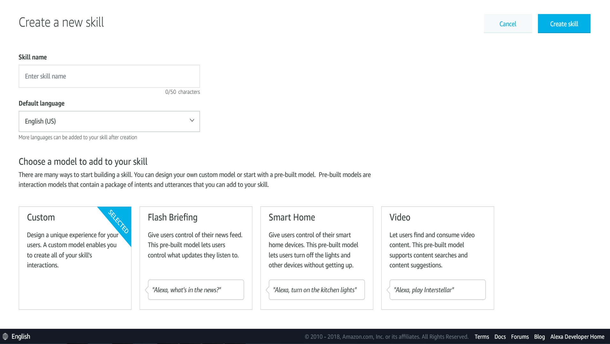
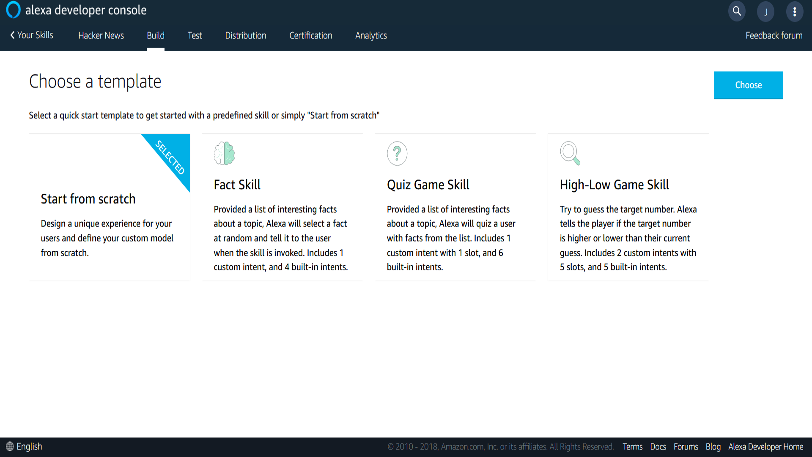
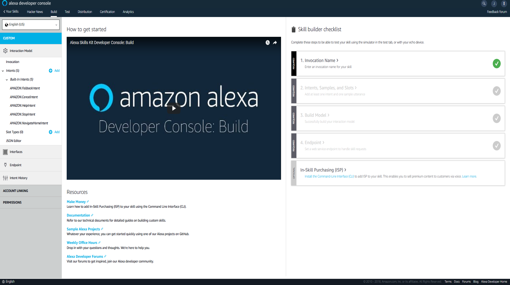
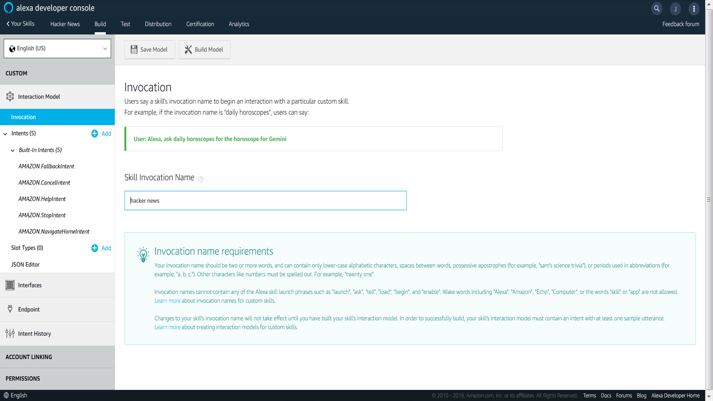
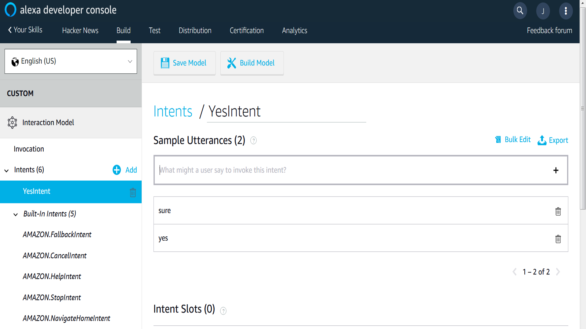
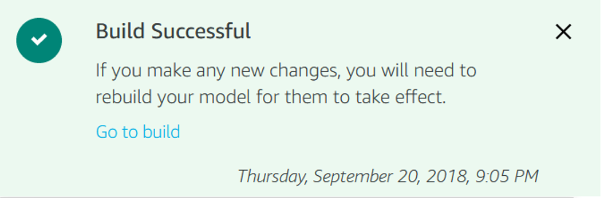

# Building an Alexa skill

This repository showcases how to develop an Alexa skill. For the purpose of demonstration __we build a skill that accesses the [Hacker News website](https://thehackernews.com/) via the [Hacker News API](https://github.com/HackerNews/API) and parses the top 10 stories listed at the time and makes an Echo device read them out loud__. 

The workflow is inspired by the video series by Harrison Kinsley (part [1](https://pythonprogramming.net/intro-alexa-skill-flask-ask-python-tutorial/), [2](https://pythonprogramming.net/headlines-function-alexa-skill-flask-ask-python-tutorial/?completed=/intro-alexa-skill-flask-ask-python-tutorial/), [3](https://pythonprogramming.net/testing-deploying-alexa-skill-flask-ask-python-tutorial/?completed=/headlines-function-alexa-skill-flask-ask-python-tutorial/)) and the [blog post](https://blog.craftworkz.co/flask-ask-a-tutorial-on-a-simple-and-easy-way-to-build-complex-alexa-skills-426a6b3ff8bc) by Bjorn Vuylsteker. 

## Requirements

You need...
* an [Amazon Echo device](https://en.wikipedia.org/wiki/Amazon_Echo) (either an Amazon Echo, Amazon Echo Plus or Amazon Echo Dot).
* an [Amazon Developer account](https://developer.amazon.com/com/)
* (recommended) the [Amazon Alexa app](https://en.wikipedia.org/wiki/Amazon_Alexa#App)

Further we need some software tools...

* a [Python](https://www.python.org/) installation  (tested on $\geq 3.6$)
* [Flask-Ask](https://github.com/johnwheeler/flask-ask)
* [requests](http://docs.python-requests.org/en/master/) 
* (recommended) [Ngrok](https://ngrok.com/)

## Getting started

The workflow consists of three main steps:

1. Build the data retrieval system
2. Build a web app 
3. Build the Alexa skill

## 1 - Data retrieval system

In this part we build the functionality to access and parse data from the [Hacker News website](https://thehackernews.com/). Therefore, we use Python and in particular the `requests` and the `json` module. 

> Create an empty Python file, named `alexa_app.py`. 

We start by importing the modules of interest:

    import json
    import requests

We further make use of the [Hacker News API](https://github.com/HackerNews/API), which provides an interface to retrieve the ids (basically just a number, associated with a particular item in the Hacker News database) of the top stories on the site at the time of query:   

    https://hacker-news.firebaseio.com/v0/topstories.json?print=pretty

If you follow the link above you see that we get in return a [json](https://www.json.org/) structure, ranking a number of items. Being aware of the data representation we can write a Python function, called `get_top_stories`, to retrieve a specified number of entries:   

    def get_top_stories(top=10):
        sess = requests.Session()
        url = 'https://hacker-news.firebaseio.com/v0/topstories.json?print=pretty'
        html = sess.get(url)
        ids = json.loads(html.content.decode('utf-8'))
        ids = ids[:top]
        return ids

Once we extracted the item ids, we may use another call of the Hacker News API to extract additional information, among others the title or the url of the referenced item, with respect to a particular id:

    https://hacker-news.firebaseio.com/v0/item/8863.json?print=pretty

The link above provides additional information for the item with the id of `8863`. In the nexte step we write a Python function, called `get_item_dict`,  to read the additional information for any given number of ids and store them into a Python dictionary, which is a data structure made of  a set of `key : value` pairs.

    def get_item_dict(ids):
        item_dict = {}
        sess = requests.Session()
        for item in ids:
            url = 'https://hacker-news.firebaseio.com/v0/item/{}.json?print=pretty'.format(item)
            html = sess.get(url)
            item_data = json.loads(html.content.decode('utf-8'))
            item_dict[item] = item_data
        return item_dict

For the purpose of this showcase we are only interested in the titles of the selected items, hence we write one more Python function, called `process_info`, to extract the titles of items organized in form of a Python dictionary, and puts these titles into a string object.  

    def process_info(item_dict):
        titles = []
        for key in item_dict.keys():
            titles.append(item_dict[key].get('title'))
        item_info = "... ".join([x for x in titles])
        return item_info

Well, we are done! The only thing left is to write another function, called `get_headlines`, which simply calls all the functions we have written so far in a particular order.

    def get_headlines():
        top_stories_ids = get_top_stories()
        item_dict = get_item_dict(top_storiesids)
        data = process_info(item_dict)
        return data

The result of the `get_headlines` function will be a simple character string object, hence plain text, of the ten top stories on the Hacker News website at the time of query. 

## 2 - Build a web app 

In the second step we have to build an application, where our Alexa skill lives. Therefore use [Flask](http://flask.pocoo.org/), a Python microframework for web applications. Further, we use the [Flask-Ask](https://github.com/johnwheeler/flask-ask), an extension to Flask that makes building Alexa skills for the Amazon Echo easier.

First we import the `Flask` object class from the flask module and create an instance of a Flask object and name it `app`. 
    
    from flask import Flask
    app = Flask(__name__)

Flask makes it very easy to run a web application. 

    @app.route('/')
    def homepage():
        return "Welcome to the Hacker News Reader, an Alexa skill to get the top trending stories in the digital sphere."
        
    if __name__ == '__main__':
        app.run(debug=True)
        
Running these very few lines of code with Python interpreter will spin up a local sever, by default at port 5000 (http://127.0.0.1:5000/). An will show an html rendered site with the text defined above.

Flask-Ask extends the functionality of Flask. Hence we import some functionality we need from Flask-Ask and we then create an instance of Flask-Ask object, named `ask`. Note that in the function call below we reference the Flask object `app` and we further provide a path (`"/hacker_news_reader"`), where our Alexa skill will live.

    from flask_ask import Ask, statement, question
    ask = Ask(app, "/hacker_news_reader")

Now we have to program the logic of our skill. For the purpose of demonstration we keep this example simple. We want two things to happen: 

1. If we start the skill we want Alexa to provide us with question.
2. If we answer with 'yes', some magic happens, if we answer 'no' the Alexa session will be terminated.

OK, let’s start with the introductory question. We write a function `start skill`, which ask us a more or less meaningful question:

    @ask.launch
    def start_skill():
        welcome_message = 'Hello there, would you like the top stories of hacker news?'
        return question(welcome_message)

Now we are to decide if we want to continue, then the function `share_headlines` will  be called, or otherwise the function `no_intent`.Both times the functions simply return a string; once one of the headlines we provided with all the helper function of part 1, or simply on line of text, some ending statement.

    @ask.intent("YesIntent")
    def share_headlines():
        headlines = get_headlines()
        headline_msg = 'The current hacker news top stories headlines are {}'.format(headlines)
        return statement(headline_msg)

    @ask.intent("NoIntent")
    def no_intent():
        bye_text = 'I am not sure why you asked me to run then, but okay... bye'
        return statement(bye_text)

Note that in all of the cases we use functions, such as `question` and `statement` as provided by the Flask-Ask module.

Finally, as we want to run the Python script by the calling it from the command line we have to add two more lines of code:

    if __name__ == '__main__':
        app.run(debug=True)
        
That´s it. We are done. The skill is ready to be deployed. Therefore, however, we have to go to our [Amazon Developer account](https://developer.amazon.com/com/) and register our new skill.

## 3 - Build the Alexa skill

In this part we actually build the Alexa skill. Therefore login into your [Amazon Developer account](https://developer.amazon.com/com/), move to the _developer console_ and there click on the _Alexa Skills Kit_ tab. There you should find a _Create new skill_ button; click on it!

### Create new skill
There you should ecounter an menu similar to the one below:

Now we give the skill a name, such as `Hacker News` and go allowg with the `Custom skill` type. 

### Choose template

In the next menu we are asked to choose a template; we pick `Start from scratch`.

### Skill builder

Finally we get to the menu, where we actually start building the interaction model. There is a lot of information on that page, please focus on the right side of the screen, on `Skill builder checklist`.

There are four mandatory steps we have to take:

1. Invocation Name
2. Intents, Samples, and Slots
3. Build Model
4. Endpoint

Let's start! Just click on the boxes to go through each of them.

#### 1. Invocation Name

Here we have to provide an invocation name, which is basically the the Alexa is listening to. We decide on `hacker news`. So if we would like to start our skill we would simply say _"Alexa, hacker news"_.

#### 2. Intents, Samples, and Slots

Now we have to provide the logic for our skill. Recall, our skill is supposed to read out loud the 10 topstories from the website Hacker News. Hence, we create two intents, one positve intent, e.g. denoted as `YesIntent`, which will basically start our skill, and a negtive intent, e.g. denoted as `NoIntent`, which will bascially deny to strat our skill. 

Once we created an new intent by clicking on `Create custom intent` box and provifing a name the intent, such as `YesIntent` (note thet you may call this intent however you want), we are aksed to provide _sample utterances_. Which in our case might by words like _"yes"_ or _"sure"_.  

Once we are done, we repeat this by defining an intent denoted as `NoIntent` and provide the word _"no"_ as a sample utterance.

#### 3. Build Model

Now we are ready to buil our interaction model. Click on the icon `Build Model` or go back to the skill builder checklist and click the button `Build Model`. In either case your model will now be build in the background, this may take some amount of time. Once your model is successfully build you get a notification:

Host your endpoint using an HTTPS web service that you manage.